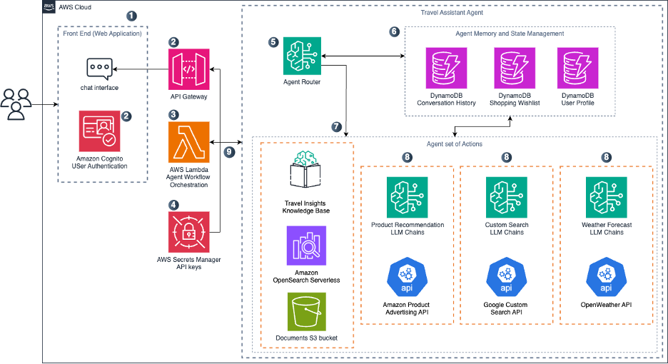

# Travel Assistant Agent

This demo features an intelligent travel assistant chatbot powered by [Amazon Bedrock](https://aws.amazon.com/bedrock/) and built with [LangGraph](https://langchain-ai.github.io/langgraph/). The assistant demonstrates advanced conversational AI capabilities for travel planning, recommendations, and shopping assistance.

## Key Features

The travel assistant provides the following capabilities using natural language:

### Travel Planning & Information
- **Trip Recommendations**: Destination advice using Amazon Bedrock Knowledge Base
- **Weather Forecasting**: Real-time weather data for travel destinations
- **Internet Search**: Current events and local information lookup
- **Amazon Facts**: Information about Amazon services and policies

### Shopping & Cart Management
- **Packing List Generation**: Personalized packing lists with Amazon product suggestions
- **Product Search**: Search Amazon catalog for travel-related items
- **Grocery Lists**: Create grocery lists with Amazon ASINs
- **Cart Management**: Add, remove, and manage items in your cart
- **History Integration**: Add previously mentioned products to cart

### Conversation Features
- **Chat Summarization**: Summarize conversation history
- **User Profiles**: Maintain user preferences and trip information
- **Multi-turn Conversations**: Context-aware responses across sessions

## Architecture

The system consists of:
- **LangGraph Agent** (`agents/travel-agent-langgraph/`): Multi-node conversational AI agent
- **Web Frontend** (`web/`): React-based chat interface
- **Backend Infrastructure** (`backend/`): AWS CDK deployment stack
- **Knowledge Base** (`data/`): Travel destination information for RAG

For detailed agent documentation, see [Agent README](agents/travel-agent-langgraph/README.md).

### System Architecture



The Travel Assistant Agent operates within a comprehensive AWS-based architecture that integrates multiple services and APIs to deliver a seamless travel planning experience. The system consists of several key layers:

**Frontend Layer**: A React-based web application hosted on Amazon S3 and distributed via CloudFront provides the user interface. Users interact with the travel assistant through a chat interface that supports real-time conversations.

**API Gateway & Authentication**: Amazon API Gateway serves as the entry point for all requests, with Amazon Cognito handling user authentication and authorization. This ensures secure access to the travel assistant's capabilities.

**Lambda Functions**: The core agent logic runs in AWS Lambda functions that process user requests and orchestrate responses. These functions handle the LangGraph agent execution and manage the conversation flow.

**LangGraph Agent Core**: The heart of the system is the LangGraph-based agent that uses a router node to analyze user intent and direct requests to specialized processing nodes. Each node handles specific capabilities like trip recommendations, weather forecasting, or product search.

**AI/ML Services**: Amazon Bedrock provides the foundational language models (Nova Lite and Nova Pro) for natural language understanding and generation. The system also integrates with Amazon Bedrock Knowledge Base for retrieval-augmented generation (RAG) to provide accurate travel recommendations.

**Data Storage**: Amazon DynamoDB stores user profiles, conversation history, and shopping cart data, enabling persistent sessions and personalized experiences across interactions.

**External API Integrations**: The agent connects to several external services including OpenWeather API for weather data, Google Custom Search API for real-time information, and Amazon Product Advertising API (PAAPI) for product search and recommendations.


## **To deploy:**

### Requirements:

Following requirements needs to be installed prior to provisioning this application:

- `Node.js` 16.x or higher
- `yarn` 1.x
- Docker

### **Deployment**

#### **Environment variables:**

Copy `.env.example` file to `.env` and update:

```sh
cp .env.example .env
```

```yaml
STACK_NAME=DemoTravelAsistant

# Optional: Create Bedrock Knowledge Base with documents 
KB_DOCS_PATH = Path/to/your/documents/folder

# Optional: Enable/disable Product Search (PAAPI) features
USE_PAAPI=false
```

#### **Required API Keys in AWS Secrets Manager:**

Before deploying, you must manually create the following secrets in AWS Secrets Manager:

1. **OpenWeather API Key:**
   - Secret name: `openweather_maps_keys`
   - Value: JSON object with your OpenWeather credentials:
   ```json
   {
      "openweather_key": "YOUR_API_KEY"
   }
   ```
2. **Google Search API Keys:**
   - Secret name: `google_search_keys`
   - Value: JSON object with your Google Search credentials:
   ```json
   {
      "cse_id": "YOUR_SEARCH_ENGINE_ID", 
      "google_api_key": "YOUR_API_KEY"
   }
   ```
3. **Product Advertising API Keys (Optional):**
   - Secret name: `paapi_keys`
   - Value: JSON object with your PAAPI credentials:
   ```json
   {
      "paapi_public": "YOUR_PUBLIC_KEY", 
      "paapi_secret": "YOUR_SECRET_KEY",
      "partner_tag": "YOUR_PARTNER_TAG"
   }
   ```
   
   **Note:** To use PAAPI features, you must also:
   - Download the Python SDK from [Amazon Product Advertising API SDK](https://webservices.amazon.com/paapi5/documentation/quick-start/using-sdk.html)
   - **For local development**: Extract the zip file contents into the `agents/travel-agent-langgraph/` directory
   - **For deployment**: Place the zip file (without extracting) into the `paapi5-python-sdk/` folder
   - Set `USE_PAAPI=true` in your `.env` file

#### Deploy infrastructure, back end, front end:

```sh
sh scripts/deployment/deploy.sh
```

#### **Deploy front end only:**

```sh
sh scripts/deployment/deploy-frontend.sh
```

### **To change logo:**

go in `web/src/assets` and add your image

pull in to `web/src/component/Navigation/index.tsx`
Change the import to whatever logo you are using

Create a `web/default-config.json` file with any of the following fields:
- `navBg` - Background color for the navbar
- `chatBubbleAvatarBg` - Background color for the chat bubble avatars
- `chatBubbleAvatarLogoWidth` - Width of the logo used in the chat bubble avatars

To override the navigation logo or chat bubble avatar logo, create a `nav-logo.png` or `chat-bubble-avatar-logo.png` respectively.

### **Agent Configuration:**
The travel assistant agent supports these settings:
1) Use RAG (Retrieval-Augmented Generation)
2) PAAPI product search integration
3) Multiple API integrations (Weather, Google Search)

### **Local testing:**
`yarn dev` in web directory will run application on localhost:5173

### **Cleanup:**
```sh
sh scripts/deployment/destroy.sh
```


## Security

See [CONTRIBUTING](CONTRIBUTING.md#security-issue-notifications) for more information.

## License

This library is licensed under the MIT-0 License. See the LICENSE file.
